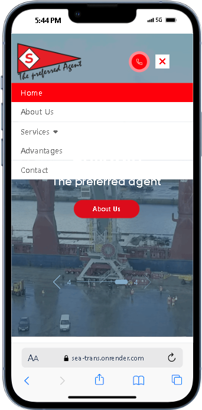

## SeaTrans:

A Robust Elementor Template Conversion into React JS for Streamlined Development

**SeaTrans** empowers you to streamline your React.js web application development with a comprehensive template foundation. This meticulously crafted template offers a clean, modern, and versatile layout that readily adapts to your project's specific requirements.

---

## Demo

## 

## Features

- **Responsive Design:** SeaTrans is built with responsiveness in mind, ensuring a seamless experience on different devices.

- **Modern Layout:** A clean and modern layout that can be easily customized to suit your project requirements.

- **Flexible Components:** Learn about reusable and flexible React components that enhance code modularity.

- **Styling:** Utilizes CSS for styling, providing a foundation for adding your own design elements.

- **Fast Performance:** The website emphasizes speed, suggesting that SolutionM4 is built for performance and efficiency. This can translate to a smooth user experience for your web applications.
- **Flexible and Reliable:** The combination of flexibility and reliability suggests that SolutionM4 offers a foundation that can adapt to your project's needs while remaining dependable.

---

---

## ⚙️ Tech Stack

---

**Project Images**

